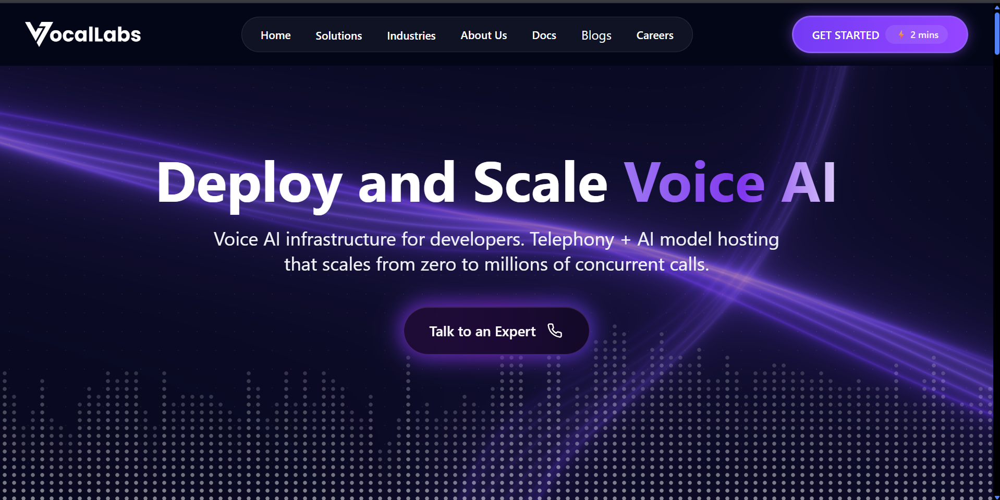
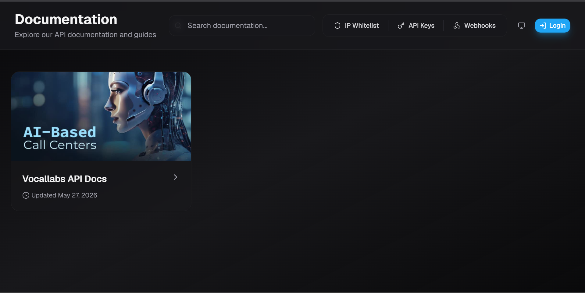
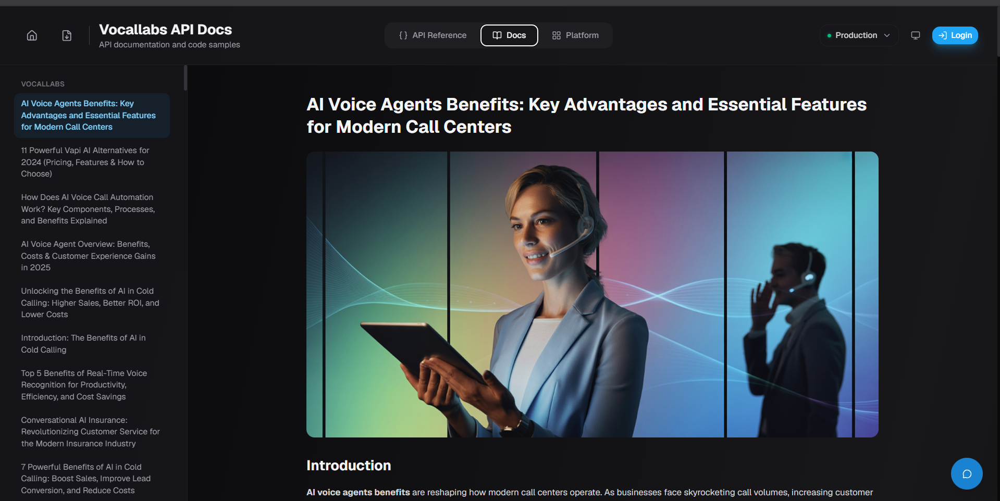
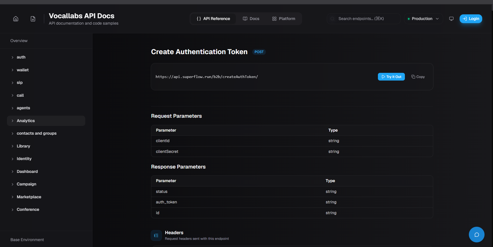
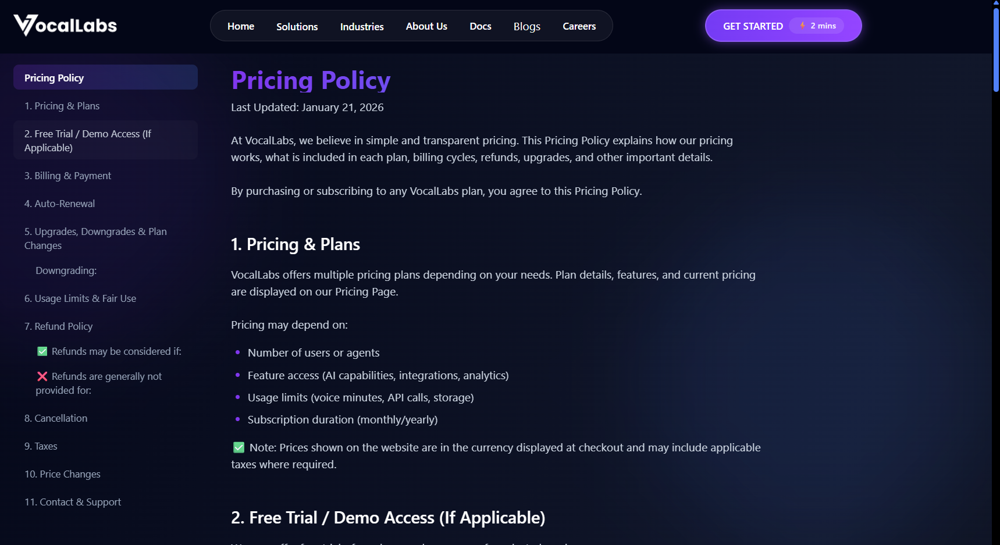
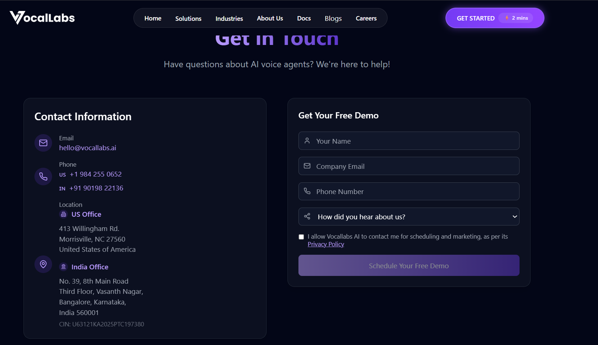

# Product Teardown — Vocallabs.ai
**Product Intern Assignment | Harsh Patil | May 2026**

---

## About the Product & ICPs

Vocallabs.ai is a Voice AI infrastructure platform — telephony + AI model hosting (LLM, TTS, ASR) in one stack, targeting developers and CX/ops teams at call-heavy businesses. Claimed moats: India-first language tuning, sub-300ms latency, full-stack ownership from design → execution → analytics.

**ICPs:**
- Developers/AI product teams building voice agents
- CX/call-center leaders at B2B SaaS, BFSI, FMCG, healthcare companies

---

## Feedback 1 — GTM & ICPs
**Pillar: GTM & ICPs**

### (a) Observed
The homepage hero says *"Voice AI infrastructure for developers"* with infra-first language ("Any Protocol. One API.", "typed SDKs", "sub-300ms latency"), but **every single CTA on the page leads to a contact/demo form** — "Talk to an Expert" and "GET STARTED ⚡ 2 mins" both open the same lead capture form asking for Name, Company Email, and Phone. There is no sandbox, no free trial, no self-serve path for developers anywhere.

### (b) Problem
The site positions developer-first but acts sales-first. Developers evaluate infra products by testing them — they expect an API key and a quickstart, not a sales call. Sending all CTAs to a contact form creates friction that causes developer ICPs to bounce immediately. At the same time, business/CX buyers who click "Talk to Expert" don't get a clearly ROI-focused journey either — no metrics like "reduced AHT by X%", no case studies on the homepage. Both personas are underserved by the same funnel.

### (c) Ship Instead
Split the CTA path above the fold:
- **For developers:** "Get API Key – Free" → self-serve quickstart + test sandbox
- **For business buyers:** "Book a Demo" → current contact form

Add a homepage toggle: *"I'm a Developer / I run a Business"* — each shows tailored copy, proof points, and CTAs. This is a battle-tested pattern used by Twilio and Vapi.

---

## Feedback 2 — Features / Developer Onboarding
**Pillar: Features / Services**

### (a) Observed
The "Docs" link in the main nav opens `docs.vocallabs.ai`, which contains **only blog articles** — "AI Voice Agents Benefits", "11 Powerful Vapi AI Alternatives", "Benefits of AI in Cold Calling", etc. The actual API Reference is a separate, hard-to-find tab inside the docs portal, which opens directly to a POST endpoint (`createAuthToken`) — no quickstart, no Hello World call guide, no code samples in multiple languages. There is no public sandbox, no free trial signup, and no "first call in 5 minutes" path anywhere on the site.

### (b) Problem
For a developer-first infra product, this is the highest-friction failure in the funnel. When a dev clicks "Docs" from the homepage and lands on blog articles about cold calling, the signal is: *this product is not actually dev-first.* Vapi, Retell AI and Twilio all offer interactive playgrounds, free tiers, and step-by-step quickstarts accessible without a sales conversation. Vocallabs being gated behind a sales call directly kills developer activation, trial rates, and organic community adoption.

### (c) Ship Instead
- Rename "Docs" in the nav to **"Developer Docs"** (true API reference) — move blog content exclusively under "Blogs"
- Add a **Quickstart page**: (1) create API key, (2) configure phone number, (3) make your first test call — with code tabs for Python, Node.js, and cURL
- Offer a **free starter tier** (e.g., 50 free minutes) with no sales call required. Make it the primary CTA for developer visitors

---

## Feedback 3 — Competitor Analysis
**Pillar: Competitor Analysis**

### (a) Observed
Vocallabs operates in a crowded space: Vapi, Retell AI, Bland AI, Twilio on the global side, and Bolna, Yellow.ai, Gnani.ai, Sarvam AI on the India side. The VocalStack product page lists technical connectors to Retell, Bland, Vapi, and ElevenLabs, but the main marketing site has **no competitor comparison page**, no "Why Vocallabs over X" section, no benchmark table, and critically — no India-specific differentiation proof (no list of supported Indian languages, no Hindi/Hinglish accuracy benchmarks, no data residency callouts for BFSI buyers).

### Competitor Snapshot

| Dimension | Vocallabs | Vapi | Twilio | Bolna (India) |
|---|---|---|---|---|
| Positioning | Full-stack Voice AI infra | Dev-first voice agent orchestration | CPaaS + voice pipeline | India-first voice agent platform |
| Free tier | Not visible | Yes | Yes | Yes |
| Quickstart | No | Yes | Yes | Yes |
| India languages | Claimed, not proven on site | Limited | Limited | Strong |
| Pricing visible | No | Yes | Yes | Yes |

### (b) Problem
Developers and CX buyers actively compare options before committing. Searches for "Vapi alternatives India" currently surface Bolna and others before Vocallabs. Without a comparison page or India benchmarks, Vocallabs loses the consideration stage entirely to competitors who have invested in comparison SEO. The "India-first" moat is completely invisible on the marketing site — making it sound like a generic talking point rather than a real structural advantage.

### (c) Ship Instead
- Build dedicated **"Vocallabs vs. [Competitor]"** pages (Vapi, Retell AI, Twilio) — these drive high-intent organic traffic from developers actively evaluating alternatives
- Add an **India-first proof block** on the homepage: list of supported Indian languages, short audio demos in Hindi/Hinglish/Tamil, India server latency benchmarks, and BFSI-relevant compliance callouts
- Surface **Paytm and Paytm Money** customer logos more prominently as anchor enterprise social proof in India

---

## Feedback 4 — UX
**Pillar: UX**

### (a) Observed
There is **no Pricing page** in the main navigation. The only pricing reference is a "Pricing Policy" link in the footer that contains legal T&Cs — not actual plan tiers or costs. Additionally, the homepage contains a large section with multiple product/sub-brand cards — VocalAssist, App.vocallabs, Hiringg, PocoDisk, VocalStack Platform — displayed as a grid with no explanation of what each product is or how they relate to each other.

### (b) Problem
Missing pricing causes two specific conversion failures:
1. Self-serve developers can't evaluate cost without a sales call, destroying bottom-up adoption
2. Enterprise buyers who Google "Vocallabs pricing" and find nothing lose trust — opacity signals uncertainty

The 15-product grid on the homepage further confuses first-time visitors: is Vocallabs a voice infra platform, a hiring tool (Hiringg), a storage product (PocoDisk)? Unclear product boundaries dilute the core positioning and increase bounce rates.

### (c) Ship Instead
- **Add a Pricing page to the main nav** with at least 3 tiers: Starter (free, 50 mins), Growth (per-minute, show the 45p/min figure from VocalStack page), Enterprise (contact sales)
- **Remove the sub-brand product grid from the homepage** — move it to a dedicated "Our Products" or "Ecosystem" page in the footer
- The homepage should focus exclusively on the VocalStack/voice-infra pitch

---

## Feedback 5 — Potential Collaborations
**Pillar: Potential Collaborations**

### (a) Observed
The VocalStack product page lists integrations with HubSpot, Salesforce, Zoho, Freshworks, Zendesk, Intercom, and Indian telephony providers like Exotel, Ozonetel, and Airtel IQ. However, these are listed as a technical feature on a product sub-page — not co-marketed as partnerships, not surfaced in the nav, and not distributed through partner marketplaces. There is no "Integrations" or "Partners" page in the main site navigation.

### (b) Problem
For an infra product, **integrations are the GTM channel.** When a startup already uses HubSpot or Freshworks, the natural discovery path is: find Vocallabs in the HubSpot App Marketplace → install → start building. Without marketplace listings, Vocallabs misses a zero-CAC distribution channel that competitors already use. Additionally, a live social impact partnership with EkStep Foundation for voice AI accessibility in India exists but appears nowhere on the main site — a missed trust and PR signal.

### (c) Ship Instead
- **Get listed in 3 high-ROI marketplaces:** HubSpot App Marketplace, Freshworks Marketplace, Zoho Marketplace — each with a co-branded integration page and setup guide
- **Add an "Integrations & Partners" page** to the main nav listing telephony providers, CRM tools, AI model providers, and social impact partners
- **Surface the EkStep/social impact story on the About page** — "Built for Bharat" narrative differentiates Vocallabs from all global competitors and creates a press/investor hook

---

## Prioritisation — What I'd Ship First

| Priority | Feedback | Rationale |
|---|---|---|
| 1 | Dev Quickstart + Free Trial (F2) | Highest impact on activation; fixes the biggest conversion leak with moderate eng effort |
| 2 | Transparent Pricing Page (F4) | Trust-builder for both devs and enterprise; reduces friction and sales cycle |
| 3 | India-first proof + Competitor pages (F3) | Drives organic SEO; makes the core moat claim tangible in buyer conversations |
| 4 | CTA / ICP split (F1) | Structural GTM improvement; needs design + copy work but compounds over time |
| 5 | Integrations marketplace distribution (F5) | Longer BD lead time; highest long-term ROI but requires partner negotiation |

> **Trade-off note:** F2 and F4 directly unlock bottom-of-funnel activation with no external dependencies — ship these in the first 4 weeks. F3 (competitor SEO) can run in parallel owned by product + content. F5 (partnerships) needs BD effort and should be a 60–90 day initiative.

---

*Vocallabs.ai · Product Intern Assignment · May 2026*